# SQL and Relational Databases

A relational database is a type of database with a specific, predefined schema that determines what data, and in what format each entry comes in, quite similar to a 2D array.

Like a 2D array, A relational database consists of rows and columns of cells, each with their own pre-determined acceptable datatype and acceptable ranges.
Standard use of a relational database dictates that each row consists of an object, concept, or singular entity of some kind, with additional cells containing stats that relate to said concept. An easy example would be a cell containing the title of a movie, with additional cells dictating it's runtime, it's aggregate rating from viewers, it's total sales, etc.

As for SQL itself, SQL is a programming language that is used for modifying, appending to, deleting, creating, mutating, or combining entries of relational databases, or the entire database itself.

Below are some exercises from SQLBolt.com and my associated proofs of completion, which should highlight both what SQL is capable of, and what a relational database looks like.

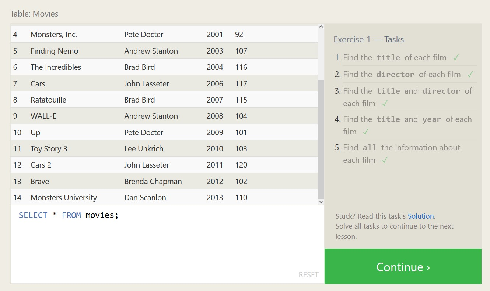
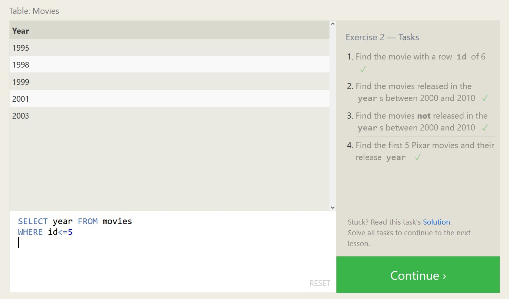
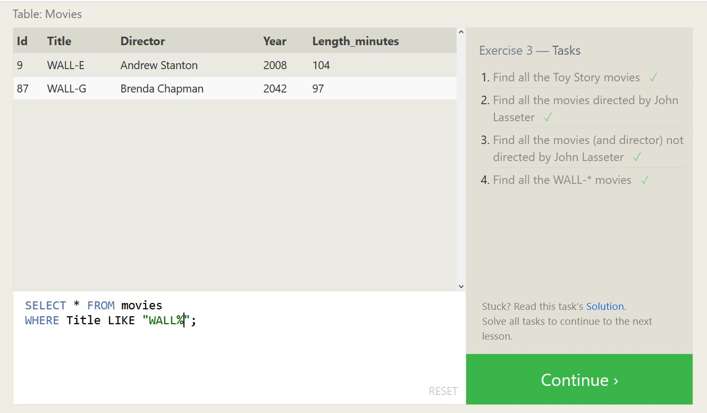
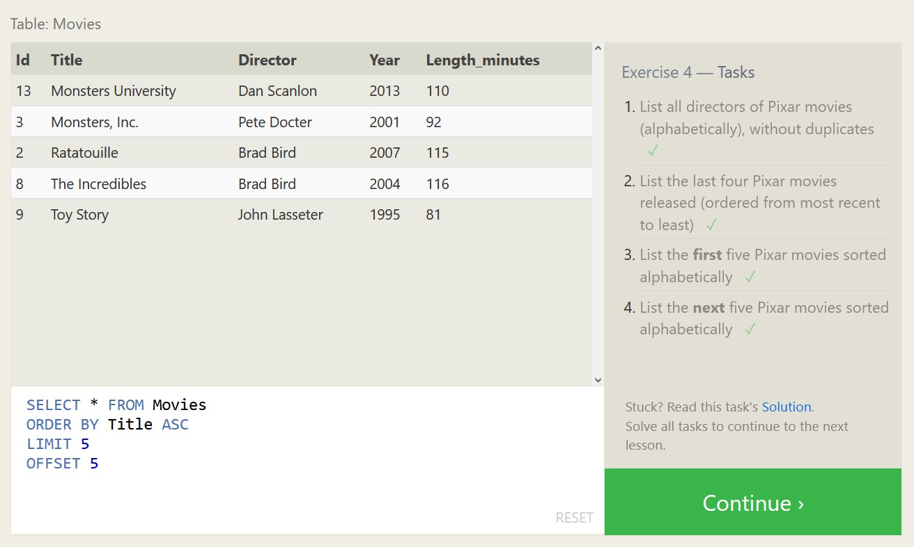
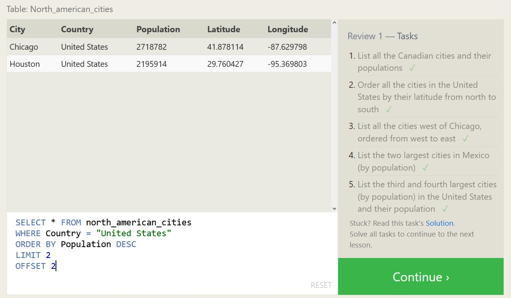
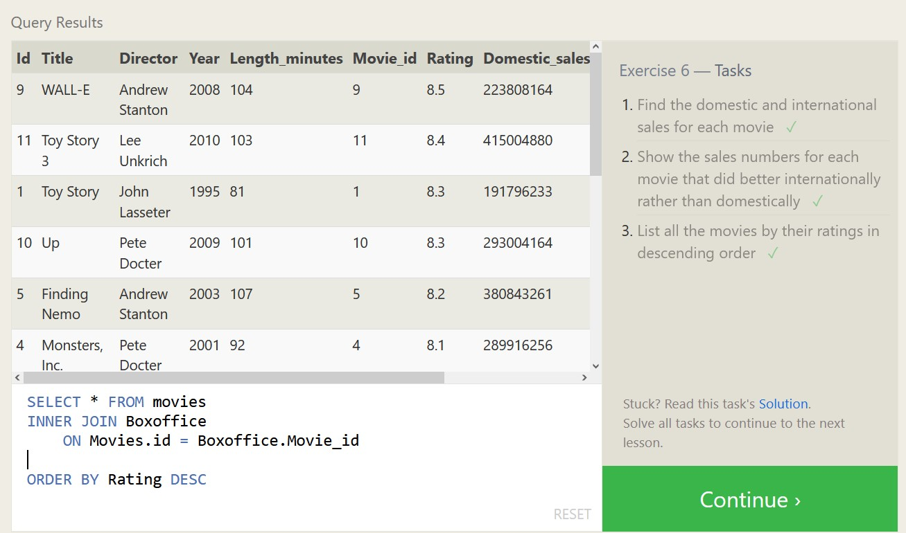
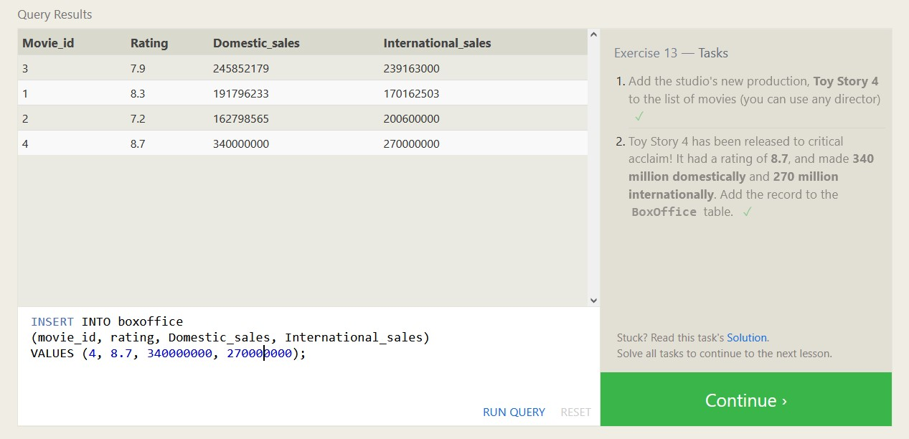
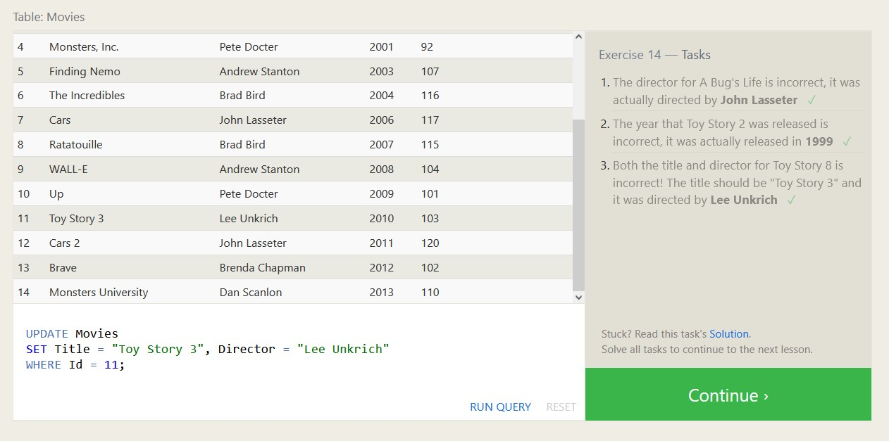
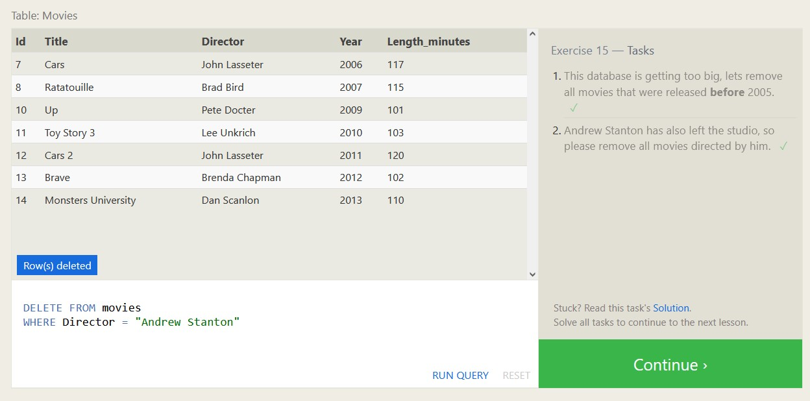
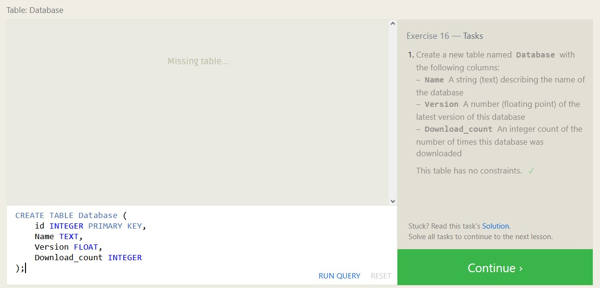
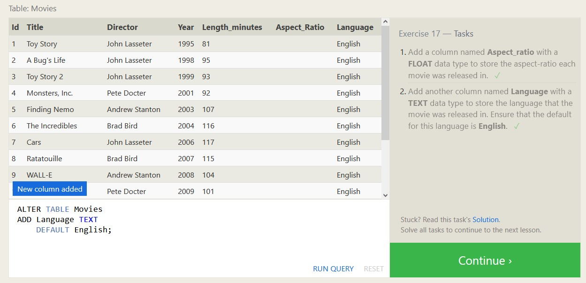
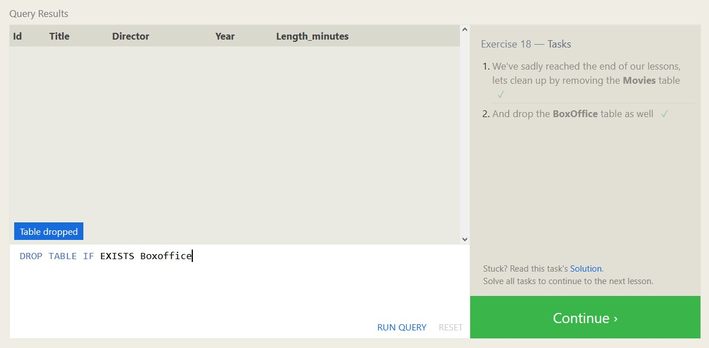

#### [Back To Main Page.](https://colorinvert.github.io/reading-notes/)
